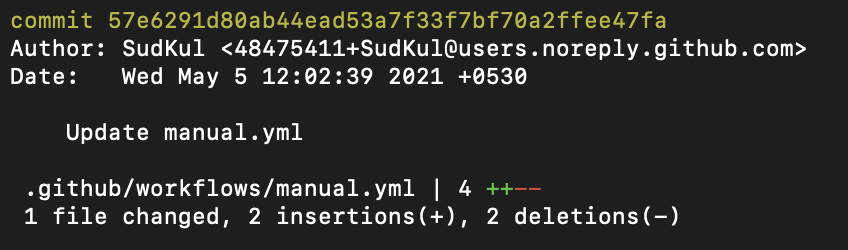
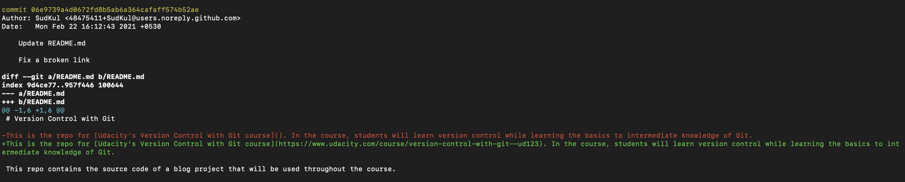

# Git Cheatsheet
For more information please see the [Git Documentation](https://git-scm.com/doc)
# Key Terms
__Version Control System (VCS) or Source Code Manager (SCM)__

A VCS allows you to:
- Revert files back to a previous state
- Revert the entire project back to a previous state
- Review changes made over time
- See who last modified something that might be causing a problem
- Identify who introduced an issue and when

__Commit__

Git treats your directory as a set of snapshots of a mini file system. Every time you commit (save the state of your project in Git), it takes a "picture" of your files at that moment and stores a reference to that snapshot.

__Repository (Repo)__

A repository is a directory that contains your project's files and hidden files used by git.  Repositories exist locally on your computer or as a a remote copy on another computer.

__Working Directory__

The folder in your computer's file sytem that contains all of your project's files.  This is different from the files saved in commits within a repository or the command line's current working directory.

__Checkout__

The process of copying a repository's content into the working directory.

You can checkout:

- Files
- Commits
- Branches

__Staging Area (Staging Index or Index)__

A file in the repository that stores information about what will go into your next commit. Think of it as a prep table where git organizes the next commit. Files in the Staging Area are ready to be added to the repository.

__SHA (SHA Hash)__

An ID number for each commit. SHAs contain are a 40-character string composed of digits and lowercase letters and are calculated based on the contents of a file or directory in a repository.
  
Example SHA:

```git
e2adf8ae3e2e4ed40add75cc44cf9d0a869afeb6
```

__Branch__

git creates a tree of commits to help you manage different states of your directory.  Each commit is it's own node in the tree.  Each git tree starts out with one branch of commits, and may create separate branches stemming from the first branch.  This can allow developers to test features without messing up the original branch.

> Analogy: A branch is like a checkpoint in a game. You can create a checkpoint, try a risky move, and return to the checkpoint if needed. Branches let you create checkpoint on one branch and switch to another branch for independent work.

# Some Useful Terminal Commands

`ls` - Creates a list of files and sub-directories in your terminals working directory

`mkdir` - Creates a new directory

`cd` - Lets you navigate directories

`rm` - Removes files or sub-directories

`cd ..` - Go back one directory

`cd ../..` - Go back two directories


# Installing Git
## Windows
Go to [https://git-scm.com/downloads](https://git-scm.com/downloads) and download the software for the Windows installation, choosing all of the default options.  Once everything is installed, you should be able to run git on the command line. If it displays the usage information, then you're good to go!

## Mac
Git is actually installed on MacOS, but we'll be reinstalling it so that we'll have the newest version:

Go to [https://git-scm.com/downloads](https://git-scm.com/downloads) and download the software for Mac.  Install git choosing all of the default options.  Once everything is installed, you should be able to run git on the command line. If it displays the usage information, then you're good to go!

# Git Set Up
## First Time Git Configuration Commands
```git
# Set your default text editor for commits (The most basic one is nano, but you can also use vim!)
git config --global core.editor "Your text editor"

# Access your current git configurations
git config --list

# Set up Git with your name for the username global variable
git config --global user.name "<Your-Full-Name>"

# Sets up Git with your email for the email global variable
git config --global user.email "<your-email-address>"

# Makes sure that Git output is colored
git config --global color.ui auto

# Displays the original state in a conflict
git config --global merge.conflictstyle diff3
```

## Setting Up Git on Various IDEs
```git
# Atom
git config --global core.editor "atom --wait"

# Sublime Text
git config --global core.editor "'/Applications/Sublime Text 2.app/Contents/SharedSupport/bin/subl' -n -w"

# VS Code
git config --global core.editor "code --wait"
```

# Git Commands
## Git Init
Before you can do anything with a git repository, it needs to actually exist in your local directory, so to create a new repository with git, you need to use the `git init` command.

The `init` command is short for "initialize", which is helpful because it's the command that will do all of the initial setup of a repository.

Whenever you initialize a git repository, a hidden directory called `.git` is created.  The `.` in front of `git` makes the repository hidden on mac os.  This directory is your git repository!

> Note:
> 
> Please do not edit any files in `.git`, as it might mess up the log of files in you are keeping track of.

Here's a brief overview on each of the items in the .git directory:

__config file__

This is where all project specific configuration settings are stored.

Git looks for configuration values in the configuration file in the Git directory (.git/config) of whatever repository you’re currently using. These values are specific to that single repository.

For example, let's say you set that the global configuration for Git uses your personal email address. If you want your work email to be used for a specific project rather than your personal email, that change would be added to this file.

__description file__

this file is only used by the GitWeb program, so we can ignore it

__hooks directory__

This is where we could place client-side or server-side scripts that we can use to hook into Git's different lifecycle events

__info directory__

This contains the global excludes file

__objects directory__

This directory will store all of the commits we make

__refs directory__

This directory holds pointers to commits (basically the "branches" and "tags")

Other than the "hooks" directory, you shouldn't mess with pretty much any of the content in here. The "hooks" directory can be used to hook into different parts or events of Git's workflow.

## Git Clone
`git clone` allows you to clone (copy) a remote repository locally in your computer. Typically you write the URL after the command

```git
git clone <https://github.com/user/repository-name>
```

When cloning a repository, a new directory named after the repository name found in repository's url is created to store all files related to the repository.  You can change the name of the directory by using the following command

```git
git clone <https://github.com/user/repository-name> <new-directory-name>
```

## Git Status
The `git status` will tell you what Git is thinking and the state of our repository as Git sees it.ou It's a good habit to gun `git status` after any other command. This will help you learn how Git works and it'll help you from making (possibly) incorrect assumptions about the state of your files/repository.

To run the command, simply run

```git
git status
```

## Git Logs
`git log` allows you to view the history of changes of your project.  You can see who makes commits, commentary of people making commits, push actions, and so on.

To view the git log, simply type

```git
git log
```

Here are some helpful keys to navigate the log:

- to scroll down, press `j` or $\downarrow$ to move down one line at a time
- `d` to move by half the page screen
- `f` to move by a whole page screen
- to scroll up, press `k` or $\uparrow$ to move up one line at a time
- `u` to move by half the page screen
- `b` to move by a whole page screen
- press `q` to quit out of the log (returns to the regular command prompt)

Here are some important outputs of the log

`SHA` - `git log` will display the complete `SHA` (commit ID) for every single commit. Each `SHA` is unique, so we don't really need to see the entire `SHA`.

__Author__

`git log` displays the commit author for every single commit! It could be different for other repositories that have multiple people collaborating together.

__Commit date__

By default, `git log` will display the date for each commit.

__Commit message__

This is one of the most important parts of a commit message...we usually always want to see this

To view just the commit messages, you can type

```git
git log --oneline
```

###  Git Log Stat
` git log --stat` provides a log of activity, but rather showing comments from each commit, it shows what files were changed, and how many lines were affected. `stat` is short for statistic.

To execute this command, simply type

```git
 git log --stat
```

Each file that changes will be listed in the commit, followed by various plus and minus signs.

- The number of plus signs indicate the number lines in the file that were added
- The number of minus signs indicate the number lines in the file that were removed



### Git Log Patch
`git log --patch` or `git log-p` for short, will display the actual file changes for each commit.



The line with `diff --git a/README.MD b/README.md` states that `README.MD` was changed.  The `a` directory is the original file and the `b` directory is the new file.

The `@@ -1,6 +1,6 @@` indicators show what lines were changed in.  In the first pair of numbers, -1 indicates lines were removed starting in line 1 and the log is showing 6 lines.

The second pair of numbers indicate that starting from line 1, there was one line added and the log shows 6 lines.

> Note:
> Git reviews documents by line, so if a line was edited, git would indicate that the line was removed, then added back.

You can also combine `git log -p --stat` to show the commit messages and the document changes.

You can also reference specific SHA IDs to filter out commits by writing

```git
git log <insert commands> <SHA ID>
```
### Git Shortlog
When collaborating with other developers, your project may have a ton of commits.  We can separate commits by user by typing 

```
git shortlog
git shortlog -s # Shows the number of commits for each user
git shortlog -n # Shows users in order of the number of commits they made
git shortlog -n -s # Shows commits of each user in order of highest number of commits
```

### Filtering Logs by Author
You can also filter logs by user by typing

```
git log --author=<Author's Username> # Make sure the user name is in quotes
```

### Finding Commits in Logs Using Grep
You can also locate specific commits in `git log` based off their commit messages by using `grep`.  To find commits based on their commit messages, type

```
git log --grep="String to Find"
```

## Commits
Below are some commands related to git commits

### Git Add
`git add` allows you to add files to the staging index.  To add files, simply type 

```
git add <file name>
```

To add specific files, you can list each file name a separate them by a single space.

```
git add <file one> <file two>
```

To add all files, you can simply type

```
git add .
```

### Git Rm Cached
If you would like to remove a file from the staging index, you can type

```
git rm --cached <file name>
```

### Git Reset
To remove all files from the staging index, type

```
git reset
```

To reset your local directory to the most the last commit, you can write 

```
git reset --hard
```
> Note:
> By typing `git reset --hard`, you will be altering the files in your directory and any changes you made after your checkpoint will disappear.

### Git Commit
To make a commit, simply write 

```
git commit
```

This will then prompt you to write a commit message with a text editor

> Note:
> Commits require messages, so if you type nothing, then the commit is discarded.

If you have a small commit and do not need to write a big message, you can write

```
git commit -m "My Small Message"
```

It is best practice to make commits in increments of small changes.  Do not make a commit that changes multiple components of a project.  You also want to keep commit messages short, so here are few dos and don'ts regarding commit messages.

__Dos__
- do keep the message short (less than 60-ish characters)
- do keep the message on one line
- do explain what the commit does (not how or why!)
- do write what exactly you changed in the message

__Don'ts__
- do not explain why the changes are made (more on this below)
- do not explain how the changes are made (that's what git log -p is for!)
- do not use the word "and"
  - if you have to use "and", your commit message is probably doing too many changes - break the changes into separate commits

A tip to come up with a good commit message is to finish the phrase '_This commit will..._". However you decide to finish that phrase, use that as your commit message

If you decide that you want to write why you made a change in a commit, use the format below

```
This is my commit message describing what I changed

This is the section where I will write why I made the changes.
```

> Note:
> By leaving a space between your first line and the rest of your text in a commit message, when writing `git log --oneline`, you will only see the first line of the commit message.  This will make the logs cleaner to read.

## Tagging, Branching
### Git Tag
__Git tags__ allow you to add a label to a commit.  This can be used when a commit was pushed and was considered to be some current version of your code.

To write a tag to a commit, simply type

```
git tag -a <tag label> <Commit's SHA Number>

# -a is short for "annotate"
```

To delete a tag, simply type

```
git tag -d <tag>

# -d is short for "delete"
```

### Git Branch
Branches allow you to work on the same project with different isolated environments!

To list all branches in your repository, write 

```
git branch
```

To add a branch to your repository, simply write

```
git branch <Branch Name> <commit SHA>
```

The second value `<committ SHA>` determines what commit you would like to create a branch from.  If you don't supply a SHA for the branch, then the branch will be created on whatever commit you are currently are on.

To delete a branch, simply type

```
git branch -d <Branch Name>

# -d is short for delete
```

### Git Checkout
`git checkout` allows you to switch branches that you are working on.

To enter a branch to write code, write

```
git checkout <Branch Name>
```

When using `git checkout`.  The files in your local repository will automatically update, so be sure to commit any changes before checking out to another branch.

You can view what branch you are on when writing `git branch`.  the branch with an asterisk is active branch.


You can also create and checkout to a new branch at the same time using the following command

```
git checkout -b <New Branch Name> <Branch to create from> <commit SHA to create from>
```

To view all of you branches at once, you can write

```
git log --oneline --graph --all
```

## Merging
### Git Merge
A merge is when you want to combine one branch to another.  To merge a branch into another, you simply type

```
git merge <Branch Name>
```

When merging two branches together, its important to note which branch is active.  This is because when you execute `git merge <Branch Name>`, it takes what ever branch you typed in `<Branch Name>` and merges it INTO the active branch.  For example, if `main` is the current branch, then

```
git merge <Feature One>
```

will take all changes from the branch `Feature One` and merge them into `main`.

There are two types of merges

__Fast-Forward Merge:__
This occurs when the branch you want to merge into the active branch is ahead in commits.


Suppose you wanted to merge `Commit A` into `HEAD`.  In this case, `Commit A` is behind in commits from `HEAD`, so it would have to "fast forward" to `HEAD`.

__Regular Merge:__
Now suppose you wanted to merge `Commit C` in `HEAD`.  This will be a normal merge since `Commit C` had diverged away from `HEAD` into a new branch.

Regardless of the type of merge created, its important to note that when a merge is created, a commit is created on the active branch to indicate the merge.


### Merge Conflicts
Most of the time Git will be able to merge branches together without any problem. However, there are instances when a merge cannot be fully performed automatically. When a merge fails, it's called a merge conflict.

If a merge conflict does occur, Git will try to combine as much as it can, but then it will leave special markers (e.g. >>> and <<<) that tell you where you (yep, you the programmer!) needs to manually fix.

A merge conflict will happen when the exact same line(s) are changed in separate branches.

The text editor has the following merge conflict indicators:

1. `<<<<<<< HEAD` - Indicates the beginning of the section containing your changes (from the current branch).
1. `=======` - Separates your changes from the changes in the branch you are merging into.
1. `>>>>>>> branch-name` - Indicates the end of the conflicting section and shows the name of the branch that you are merging in.

Git is using the merge conflict indicators to show you what lines caused the merge conflict on the two different branches as well as what the original line used to have. So to resolve a merge conflict, you need to:

1. choose which line(s) to keep
2. remove all lines with indicators

Once you've removed all lines with merge conflict indicators and have selected what heading you want to use, just save the file, add it to the staging index, and commit it! Just like with a regular merge, this will pop open your code editor for you to supply a commit message. Just like before, it's common to use the provided merge commit message, so after the editor opens, just close it to use the provided commit message.

> __Resources about merge conflicts:__
> 
> [Basic Merge Conflicts](https://git-scm.com/docs/git-merge#_how_conflicts_are_presented)
> 
> [How Conflicts Are Presented](https://git-scm.com/docs/git-merge#_how_conflicts_are_presented)

## Git Amend
If you made mistakes and commited those mistakes, you can trace back to the most recent commit and fix your mistakes by first updating the files in your directory, then typing

```
git commit --amend
```

This will allow you to update the most recent commit.  After your execute `git commit --amend`, a text editor will appear for you to update the git message.

> Note:
> Please make sure all files are placed onto the staging index before amending a commit since your local files will be overwritten if you complete executing the commit.


## Git Revert
Suppose you wanted to revert back to some commit and use that commit as the most updated version of your files.  You can do that by typing 

```
git revert <Commit SHA>
```

When executing `git revert`, git will first create a new commit that reverts your files back to the target commit and shows that the files were reverted, so any intermediate commits stay in the version controls tree.

## Git Reset
`git reset` is similar to `git revert`, except `git revert` will create a new commit, then update your files while `git reset` will just delete your commit.

> __Note:__
> If you execute `git reset`, then you might not be able to recover the commit's state depending on the flag you use.

To execute `git reset`, simply type

```
git reset --<flag> <Commit SHA>
```
There are three types flags

### Mixed

`git reset --mixed` is the the default flag and that gets executed if you omit the flag in execution.  If you use `--mixed`, files will revert back to the target commit's state in your local directory.

### Soft
`git reset --soft` will take the changes made to get to the target's commit and place them in the staging index.

### Hard
`git reset --hard` will delete all the intermediate commits and revert back to the target commit.

### Relative Commit SHA References
You already know that you can reference commits by their SHA, by tags, branches, and the special `HEAD` pointer, however there will be times when you'll want to reference a commit relative to another commit. There are special characters called _Ancestry References_ that we can use to tell Git about these relative references. Those characters are:

`^` – indicates the parent commit
`~ `– indicates the first parent commit

Here's how we can refer to previous commits:

__parent commit__ – the following indicate the parent commit of the current commit

- `HEAD^`
- `HEAD~`
- `HEAD~1`

__grandparent commit__ – the following indicate the grandparent commit of the current commit

- `HEAD^^`
- `HEAD~2`
  
__great-grandparent commit__ – the following indicate the great-grandparent commit of the current commit

- `HEAD^^^`
- `HEAD~3`

The main difference between `^` and `~` is when a commit is created from a merge. A merge commit has two parents. With a merge commit, `^` is used to indicate the first parent of the commit while `^2` indicates the second parent. The first parent is the branch you were on when you ran git merge while the second parent is the branch that was merged in.

> __References__
>
> [git-reset from Git docs](https://git-scm.com/docs/git-reset)
> 
> [Reset Demystified from Git Blog](https://git-scm.com/book/en/v2/Git-Tools-Reset-Demystified)
> 
> [Ancestry References from Git Book](https://git-scm.com/book/en/v2/Git-Tools-Revision-Selection#Ancestry-References)

# .gitignore
`.gitignore` is a file that tells you which files should be ignored in your version control.  By adding files into .gitignore, you can ignore them when tracking changes.

To add a .gitignore file, just type the following in you command line

```
touch .gitignore
```

A .gitignore file will then appear in your directory in which you can open with any text editor and add files.

## Globbing
Let's say that you add 50 images to your project, but want Git to ignore all of them. Does this mean you have to list each and every filename in the .gitignore file? [Globbing](https://en.wikipedia.org/wiki/Glob_) lets you use special characters to match patterns/characters. In the .gitignore file, you can use the following:

- blank lines can be used for spacing
- `#` - marks line as a comment
- `*` - matches 0 or more characters
- `?`- matches 1 character
- `[abc]` - matches a, b, or c
- `**` - matches nested directories.  For example, a/**/z matches
  - `a/z`
  - `a/b/z`
  - `a/b/c/z`

So if all of the 50 images are JPEG images in the "samples" folder, we could add the following line to .gitignore to have Git ignore all 50 images.

# Github and Remote Repositories
Why would you want to have multiple remote repositories? If you are working with multiple developers then you might want to get changes they're working on in their branch(es) into your project before they merge them into the master branch. You might want to do this if you want to test out their change before you decide to implement your changes.

Another example is if you have a project whose code is hosted on Github but deploys via Git to Heroku. You would have one remote for the master and one for the deployment.


## Git Remote
A remote repository is a repository that's just like the one you're using but it's just stored at a different location.  To manage a remote repository, use the `git remote` command.

When your git directory is linked to a remote repository, your local repository makes an alias for it.  This alias defaults to _origin_.

To view the alias of the remote repository, you can type

```
git remote
```
To view the alias with it's URL, type

```
git remote -v
```

To add a remote repository to your local directory, write

```
git remote add <alias (typially origin)> <git repository url>
```

> References:
> [Working with Remotes from the Git book](https://git-scm.com/book/en/v2/Git-Basics-Working-with-Remotes#_showing_your_remotes)
> [The git remote command from the Git docs](https://git-scm.com/docs/git-remote)

##  Git Push
`git push` will take your local active branch and merge it into the remote branch being tracked.
To push commits to a remote repository, use

```
git push <remote-shortname> <branch>

# Remember that the defacto short name for a remote branch is "origin"
```

Depending on how you have configured GitHub and the remote URL that's being used, you might have to enter your username and password. This will happen if you use the HTTP version of the remote (rather than the `SSH` version)

## Git Pull
`git pull` is the opposite of `git push`.  Rather than merging your local active branch into your remote branch, `git pull` will take a remote branch, and merge it into your local active branch.

to execute `git pull`, simply type

```
git pull <remote-shortname> <branch>
```
## Git Fetch
`git fetch` is similar to `git pull` except rather than merging the commits that you don't have in your local branch from the remote branch, `git fetch` will just fetch the commits, then point to those commits.  To merge with the remote branch, you simply just need to execute `git merge`.

To execute `git fetch` simply type

```
git fetch <remote-shortname> <branch>
```

When collaborating with other developers, its safer to `git fetch` than `git merge` since the pointer of the remote branch might be pointing to a commit not in your local repository.

## Cloning and Forking a Repository
When you fork a repository,you are duplicating it. Typically you fork a repository that belongs to someone else. So you make an identical copy of their repository and that duplicate copy now belongs to you.

Forking a repository is different from cloning a repository.  When you fork a repository, a copy of the repository gets hosted on github or whatever hosting service you are using.  You own that remote copy on the hosting service.  When you clone a repository, you are simnply downloading the repository locally onto your computer.  This local copy does not link to a remote repository. 

To clone a repository you simply type

```
git clone <git repository url>
```

To fork a repository, you need to go to your hosting service to fork it.  Remember, forking isn't a git command, its a feature that can be done in a hosting service like github.

# Contributing to Projects
## The Contributions Markdown File
When you want to contribute to project that many developers are working on, you should look at the `CONTRIBUTING.md`.

`CONTRIBUTING Markdown File` lists out the information you should follow when contributing to the project.  You should look at it before you ever start contributing since it explains how your code should be formatted and the steps you should go about to contribute.

## Github Issues
Github has a web interface for issues which are used by developers to help track active bugs, and features/tasks to be implemented.  These issues are typically managed by maintainers of the project, and you can ask them questions using the issue interface.

Each issue can:

- Have a label or multiple labels applied to it
- Can be assigned to an individual
- Can be assigned a milestone (for example the issue will be resolved by the next major release)
- Can have comments to create a discussion thread
- Can have developers subscribe to it so that they can be notifed of issues being updated

## Topic Branches
Topic branches host commits for just a single concept or single area of change.

For example if there is a problem with the login form for logging into the website, then a branch name to address this specific issue could be called:

- `login`
- `login-bug`
- `signup-bug`
- `login-form-bug`

## Pull Requests
Before diving into pull requests (PRs), we need to know how to sync new changes in our forked remote repository and recieve updates from original source repository.

__Pull Requests__
A pull request is a request to the original or source repository's maintainer to include changes in their project that you made in your fork of their project. You are requesting that they pull in changes you've made.

Heres a high level overview of how pull requests work.  [Click here](https://www.youtube.com/watch?v=twLr9ndsf90&t=84s)

To commit a pull request you must 

1. Fork the repository
2. Make changes
   1. Possibly create a branch for your changes if needed
3. Make commits and push to your forked repository
4. On github select "Make a pull request"
5. Choose which branches you want to compare in the pull request
6. Add a message and submit the pull request

Pull Requests can only be approved and merged by the repository's owner.

## Stars and Watching

<!-- PLEASE ADD IMAGES FOR WATCHES -->
While you're working on a topic branch of changes that you want to make to a repository, that repository will probably be receiving updates of its own from the original authors.  If you want to keep up-to-date with the Repository, GitHub offers a convenient way to keep track of repositories using stars or watching.

You can star a repository then go to [https://github.com/stars](https://github.com/stars) to view all repositories that you have started.  However, you won't receive a notification in real time with stars.  Its kind of like saving a post on instagram to your favorites.

If you need to keep up with a project's changes and want to be notified of when things change, GitHub offers a "Watch" feature.  You can set a repository to "Watching" and whenever the owners make changes, your account notifies you!

## Upstream Changes
When working on another developers repository, there may be a chance that they have updated their repository and your forked repository and local repository are out of date.  You already made commits on your own and need to update your repositories to get up to date with the changes in the developer's repository before you can make your PR.

In order to update your forked and local repositories, the local repository must track both the forked and developer's repositories.  You can then push all of your updates to your forked repository.  Afterward, you can then fetch the commits of the developer's repository and merge your commits with their commits.

Recall that your remote repository typically has a short name called origin.  It is common practice to call the developer's repository the "upstream" branch.

Below is a step by step guide to keep in track with another developer's remote repository.

```git
# Track the developer's remote repository
git remote add upstream <repository URL>

# Fetch the new commits
git fetch upstream master

# Make sure to be only your origin's branch you are working on (in this case master)
$ git checkout master

# merge the upstream commits to your origin's
$ git merge upstream/master

# push to your forked repository
$ git push origin master 
```

[Here](https://www.youtube.com/watch?v=VvoC6hN6FjU&t=1s) is a better understanding on how to stayed synced

## git rebase
<<<<<<< HEAD
`git rebase` is typically used to squash commits, i.e. combine multiple commits into one commit.  To squash commits together with `git rebase`, simply type

```git
git rebase -i <base>

# i is short for interactive
```

You can use Relative Commit SHA References to refer to the commit you would like to base to.  When we say "commit to base to", we refer to which commit do the all commits sqaush into.

Below are the steps to squash commits.

1. Check out to the commit you would like to start squashing to.

```git
git checkout <Commit SHA>
```

2. Use `Git rebase` and the relative commit SHA Reference to refer to all commits that need to be squashed

```git
git rebase -i <base>
```

3. When executing `git rebase`, git will prompt you with a set of possible commands and list the commits you want to squash in reverse chronological order.  Below are those commands


- use `p` or pick – to keep the commit as is
- use `r` or reword – to keep the commit's content but alter the commit message
- use `e` or edit – to keep the commit's content but stop before committing so that you can:
  - add new content or files
  - remove content or files
  - alter the content that was going to be committed
- use `s` or squash – to combine this commit's changes into the previous commit (the commit above it in the list)
- use `f` or fixup – to combine this commit's change into the previous one but drop the commit message
- use `x` or exec – to run a shell command
- use `d` or drop – to delete the commit

Each commit needs to be assigned one of these commands.  Typically, all commits will use `s`, signifying they will be squashed and the oldest commit will use either `p` or `r` incase you would like to rewrite the commit.

4. You must force a push to the remote repository by calling

```git
git push -f <short name> <branch name>
```

You need to force a push because the rebase creates a new commit that has no reference in the remote repository, so you have to force the push to create the new commit, effectively deleting the squashed commits.

When using a forced push, you are deleting commits, so its best practice to make a branch at the commit you want to start squashing incase you need to revert back to the original commits.

__When to not rebase__
Whenever you rebase commits, Git will create a new SHA for each commit! This has drastic implications. To Git, the SHA is the identifier for a commit, so a different identifier means it's a different commit, regardless if the content has changed at all.

So you should not rebase if you have already pushed the squashed commits you want to rebase. If you're collaborating with other developers, then they might already be working with the commits you've pushed. If you then use git rebase to change things around and then force push the commits, then the other developers will now be out of sync with the remote repository. They will have to do some complicated surgery to their Git repository to get their repo back in a working state...and it might not even be possible for them to do that; they might just have to scrap all of their work and start over with your newly-rebased, force-pushed commits.

> __References:__
>
> [Git Branching - Rebasing from the Git Book](https://git-scm.com/book/en/v2/Git-Branching-Rebasing)
> 
> [git-rebase from the Git Docs](https://git-scm.com/docs/git-rebase)
> 
> [Atlassian Rebase Blog](https://www.atlassian.com/git/tutorials/rewriting-history#git-rebase)

